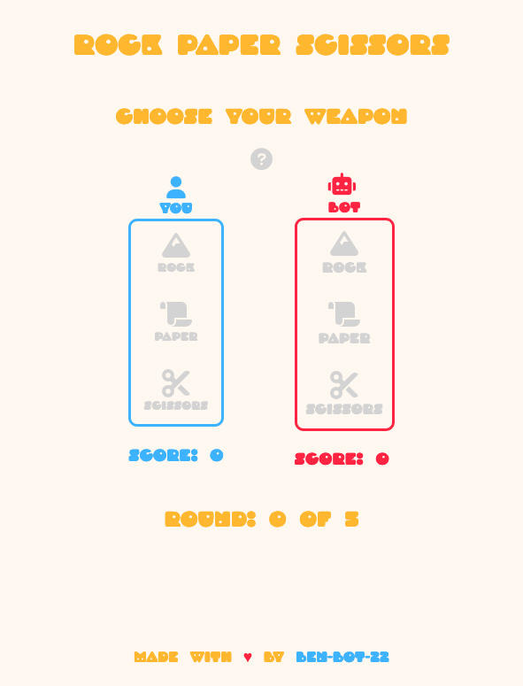

# Rock Paper Scissors

This is a solution to the "Rock, Paper, Scissors" project in the [Odin Project](https://www.theodinproject.com/lessons/foundations-rock-paper-scissors).  The Odin project is a open source tutorial for learning web development.

## Table of contents

- [Overview](#overview)
  - [The challenge](#the-challenge)
  - [Screenshot](#screenshot)
  - [Links](#links)
- [My process](#my-process)
  - [Built with](#built-with)
  - [What I learned](#what-i-learned)
- [Author](#author)

## Overview

### The challenge

Users play 5 rounds of "Rock, Paper, Scissors" against a bot.  

### Screenshot

### Links

- Solution URL: [Code on GitHub](https://github.com/Ben-Bot-22/rock-paper-scissors)
- Live Site URL: [GitHub pages live URL](https://ben-bot-22.github.io/rock-paper-scissors/)

## My process

### Built with

- Semantic HTML5 markup
- CSS custom properties
- JavaScript (vanilla)
- Visual Studio Code

### What I learned

During this project I implemented my first two modals. The first is a hover card modal attached to the (?) icon.  This explains the game to the user.  The second is a pop up modal at the end of 5 rounds. 

Resources
1) I styled my page with a palette from [Color Hunt](https://colorhunt.co/palette/3db2ffffeddaffb830ff2442).
2) The font is called [Droog by Rian Hughes](https://fonts.adobe.com/fonts/droog).
3) The icons are from [Font Awesome](https://fontawesome.com/).
4) A medium post by [Gabbie Piraino](https://medium.com/@nerdplusdog/a-how-to-guide-for-modal-boxes-with-javascript-html-and-css-6a49d063987e) helped me understand how to implement modals.  
5) A blog post by [Emad Elsaid](https://www.emadelsaid.com/implementing-hover-cards-with-minimum-javascript/) guided me through implementing a hover card modal.

## Author

- Twitter - [@benBot22](https://www.twitter.com/benBot22)